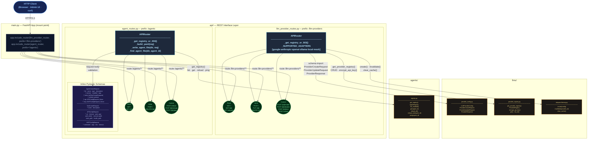

# AI Orchestrator — api/ 컴포넌트 다이어그램

```mermaid
flowchart TD

    %% ══════════════════════════════════════════════════════════
    %% 진입점
    %% ══════════════════════════════════════════════════════════
    CLIENT(["HTTP Client\n(Browser · Admin UI · curl)"])

    subgraph MAIN["main.py — FastAPI App (mount point)"]
        MOUNT["app.include_router(llm_provider_router, prefix='/llm-providers')\napp.include_router(agent_router,        prefix='/agents')"]
    end

    %% ══════════════════════════════════════════════════════════
    %% api/ 패키지
    %% ══════════════════════════════════════════════════════════
    subgraph API["api/  —  REST Interface Layer"]
        direction LR

        %% ─────────────────────────────────────────
        %% llm_provider_routes.py
        %% ─────────────────────────────────────────
        subgraph LLM_R["llm_provider_routes.py  ─  prefix: /llm-providers"]
            LLMR["APIRouter\n────────────────────────────────\n_get_registry_or_503()\n_SUPPORTED_ADAPTERS\n[google·anthropic·openai·ollama·local·mock]"]

            IF_LLM_READ(("Read\nGET  /\nGET  /{id}\nGET  /adapters"))
            IF_LLM_WRITE(("Write\nPOST  /\nPUT   /{id}\nDELETE /{id}"))
            IF_LLM_CTRL(("Control\nPOST /{id}/enable\nPOST /{id}/disable\nPOST /{id}/test\nPOST /reload"))

            LLMR --- IF_LLM_READ
            LLMR --- IF_LLM_WRITE
            LLMR --- IF_LLM_CTRL
        end

        %% ─────────────────────────────────────────
        %% agent_routes.py
        %% ─────────────────────────────────────────
        subgraph AGT_R["agent_routes.py  ─  prefix: /agents"]
            AGTR["APIRouter\n────────────────────────────────\n_get_registry_or_404()\n_build_yaml(req)\n_write_agent_file(dir, req)\n_find_agent_file(dir, agent_id)"]

            subgraph INLINE_SCH["Inline Pydantic Schemas"]
                SCH["AgentCreateRequest\n  ├ id · name · type · description\n  ├ version · enabled · tags\n  ├ tools: list[ToolCreateRequest]\n  ├ system_prompt\n  ├ api: APIConfigRequest | None\n  └ mcp: MCPConfigRequest | None\n────────────────────────────────\nToolCreateRequest\n  └ name · description\n────────────────────────────────\nAPIConfigRequest\n  └ url · timeout · auth_type\n    auth_token · execute_path\n    tools_path · health_path\n────────────────────────────────\nMCPConfigRequest\n  └ command · args · env · timeout"]
            end

            IF_AGT_READ(("Read\nGET /\nGET /{id}"))
            IF_AGT_WRITE(("Write\nPOST /\nDELETE /{id}"))
            IF_AGT_CTRL(("Control\nPOST /reload\nPOST /{id}/reload\nPOST /{id}/ping"))

            AGTR --- IF_AGT_READ
            AGTR --- IF_AGT_WRITE
            AGTR --- IF_AGT_CTRL
            AGTR -->|"request body\nvalidation"| SCH
        end
    end

    %% ══════════════════════════════════════════════════════════
    %% 외부 의존성 — llms/
    %% ══════════════════════════════════════════════════════════
    subgraph LLM_DEP["llms/"]
        direction TB
        PROV_CFG["provider_config.py\n────────────────────────────────\nLLMProviderConfig\nProviderCreateRequest\nProviderUpdateRequest\nProviderResponse"]
        PROV_REG["provider_registry.py\n────────────────────────────────\nget_provider_registry()\nProviderRegistry\n  encrypt_api_key()\n  get() · list_all()"]
        ADP_FAC["adapters/factory.py\n────────────────────────────────\ncreate(config)\ninvalidate(provider_id)\nclear_cache()"]
    end

    %% ══════════════════════════════════════════════════════════
    %% 외부 의존성 — agents/
    %% ══════════════════════════════════════════════════════════
    subgraph AGT_DEP["agents/"]
        AGT_REG["registry.py\n────────────────────────────────\nget_registry()\nAgentRegistry\n  list_enabled()\n  get(agent_id)\n  reload_all()\n  reload_one(agent_id)\n  ping(agent_id)"]
    end

    %% ══════════════════════════════════════════════════════════
    %% CONNECTORS
    %% ══════════════════════════════════════════════════════════

    %% Client → FastAPI → Routes
    CLIENT -->|"HTTP/1.1"| MOUNT
    MOUNT  -->|"route /llm-providers/**"| IF_LLM_READ
    MOUNT  -->|"route /llm-providers/**"| IF_LLM_WRITE
    MOUNT  -->|"route /llm-providers/**"| IF_LLM_CTRL
    MOUNT  -->|"route /agents/**"| IF_AGT_READ
    MOUNT  -->|"route /agents/**"| IF_AGT_WRITE
    MOUNT  -->|"route /agents/**"| IF_AGT_CTRL

    %% llm_provider_routes → dependencies
    LLMR -->|"schema import\nProviderCreateRequest\nProviderUpdateRequest\nProviderResponse"| PROV_CFG
    LLMR -->|"get_provider_registry()\nCRUD · encrypt_api_key()"| PROV_REG
    LLMR -->|"create() · invalidate()\nclear_cache()"| ADP_FAC

    %% agent_routes → dependencies
    AGTR -->|"get_registry()\nlist · get · reload · ping"| AGT_REG

    %% ══════════════════════════════════════════════════════════
    %% 스타일
    %% ══════════════════════════════════════════════════════════
    classDef routerCls  fill:#1e293b,stroke:#38bdf8,color:#bae6fd,font-weight:bold
    classDef ifaceCls   fill:#052e16,stroke:#22c55e,color:#86efac,font-size:11px
    classDef schemaCls  fill:#1e1b4b,stroke:#818cf8,color:#c7d2fe,font-size:10px
    classDef depCls     fill:#1c1917,stroke:#d97706,color:#fde68a,font-size:10px
    classDef mountCls   fill:#0f172a,stroke:#94a3b8,color:#94a3b8
    classDef clientCls  fill:#172554,stroke:#60a5fa,color:#93c5fd,font-weight:bold

    class LLMR,AGTR routerCls
    class IF_LLM_READ,IF_LLM_WRITE,IF_LLM_CTRL,IF_AGT_READ,IF_AGT_WRITE,IF_AGT_CTRL ifaceCls
    class SCH schemaCls
    class PROV_CFG,PROV_REG,ADP_FAC,AGT_REG depCls
    class MOUNT mountCls
    class CLIENT clientCls
```
