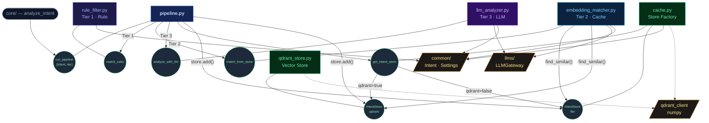

# AI Orchestrator — intent/ 컴포넌트 다이어그램

```mermaid
flowchart TD

    CALLER(["core/ — analyze_intent"])

    %% ── 컴포넌트 ─────────────────────────────────────────────
    PIPE["pipeline.py"]
    IF_PIPE(("run_pipeline\n(Intent, tier)"))
    PIPE --- IF_PIPE

    RULE["rule_filter.py\nTier 1 · Rule"]
    IF_RULE(("match_rules"))
    RULE --- IF_RULE

    MATCH["embedding_matcher.py\nTier 2 · Cache"]
    IF_MATCH(("match_from_store"))
    MATCH --- IF_MATCH

    LLMA["llm_analyzer.py\nTier 3 · LLM"]
    IF_LLM(("analyze_with_llm"))
    LLMA --- IF_LLM

    CACHE["cache.py\nStore Factory"]
    IF_FACTORY(("get_intent_store"))
    IF_STORE_F(("IntentStore\n·file·"))
    CACHE --- IF_FACTORY
    CACHE --- IF_STORE_F

    QDRANTS["qdrant_store.py\nVector Store"]
    IF_STORE_Q(("IntentStore\n·qdrant·"))
    QDRANTS --- IF_STORE_Q

    %% ── 외부 의존성 ──────────────────────────────────────────
    LLM_GW[/"llms/\nLLMGateway"/]
    COMMON[/"common/\nIntent · Settings"/]
    EXT_INFRA[/"qdrant_client\nnumpy"/]

    %% ── Connectors ───────────────────────────────────────────
    CALLER --> IF_PIPE

    PIPE -->|"Tier 1"| IF_RULE
    PIPE -->|"Tier 2"| IF_MATCH
    PIPE -->|"Tier 3"| IF_LLM
    PIPE --> IF_FACTORY
    PIPE -->|"store.add()"| IF_STORE_F
    PIPE -->|"store.add()"| IF_STORE_Q

    MATCH -->|"find_similar()"| IF_STORE_F
    MATCH -->|"find_similar()"| IF_STORE_Q

    IF_FACTORY -->|"qdrant=true"| IF_STORE_Q
    IF_FACTORY -->|"qdrant=false"| IF_STORE_F

    MATCH --> LLM_GW
    LLMA  --> LLM_GW
    RULE  --> COMMON
    MATCH --> COMMON
    LLMA  --> COMMON
    CACHE --> COMMON
    QDRANTS -.-> EXT_INFRA
    CACHE   -.-> EXT_INFRA

    %% ── 스타일 ───────────────────────────────────────────────
    classDef pipeCls   fill:#172554,stroke:#60a5fa,color:#bfdbfe,font-weight:bold
    classDef tier1Cls  fill:#1e1b4b,stroke:#6366f1,color:#a5b4fc
    classDef tier2Cls  fill:#0c2340,stroke:#0ea5e9,color:#7dd3fc
    classDef tier3Cls  fill:#2e1065,stroke:#a855f7,color:#d8b4fe
    classDef storeCls  fill:#052e16,stroke:#10b981,color:#6ee7b7
    classDef ifaceCls  fill:#1e293b,stroke:#22c55e,color:#86efac,font-size:11px
    classDef extCls    fill:#1c1917,stroke:#d97706,color:#fde68a
    classDef callerCls fill:#0f172a,stroke:#94a3b8,color:#94a3b8

    class PIPE pipeCls
    class RULE tier1Cls
    class MATCH tier2Cls
    class LLMA tier3Cls
    class CACHE,QDRANTS storeCls
    class IF_PIPE,IF_RULE,IF_MATCH,IF_LLM,IF_FACTORY,IF_STORE_F,IF_STORE_Q ifaceCls
    class LLM_GW,COMMON,EXT_INFRA extCls
    class CALLER callerCls
```
