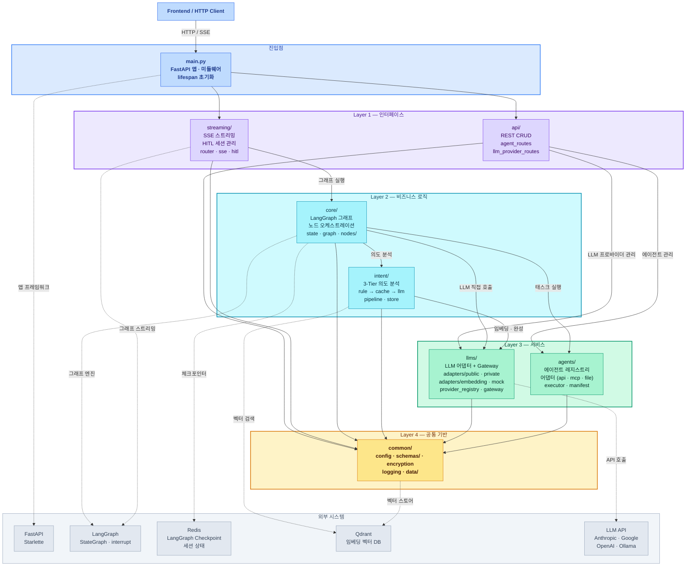

# AI Orchestrator — 전체 아키텍처 Overview

```mermaid
flowchart TD

    %% ══════════════════════════════════════════
    %% 클라이언트
    %% ══════════════════════════════════════════
    CLIENT["Frontend / HTTP Client"]

    %% ══════════════════════════════════════════
    %% Layer 0 — 진입점
    %% ══════════════════════════════════════════
    subgraph entry["진입점"]
        MAIN["main.py\nFastAPI 앱 · 미들웨어\nlifespan 초기화"]
    end

    %% ══════════════════════════════════════════
    %% Layer 1 — 인터페이스
    %% ══════════════════════════════════════════
    subgraph interface["Layer 1 — 인터페이스"]
        direction LR
        API["api/\nREST CRUD\nagent_routes\nllm_provider_routes"]
        STREAM["streaming/\nSSE 스트리밍\nHITL 세션 관리\nrouter · sse · hitl"]
    end

    %% ══════════════════════════════════════════
    %% Layer 2 — 비즈니스 로직
    %% ══════════════════════════════════════════
    subgraph logic["Layer 2 — 비즈니스 로직"]
        direction LR
        CORE["core/\nLangGraph 그래프\n노드 오케스트레이션\nstate · graph · nodes/"]
        INTENT["intent/\n3-Tier 의도 분석\nrule → cache → llm\npipeline · store"]
    end

    %% ══════════════════════════════════════════
    %% Layer 3 — 서비스
    %% ══════════════════════════════════════════
    subgraph services["Layer 3 — 서비스"]
        direction LR
        LLMS["llms/\nLLM 어댑터 + Gateway\nadapters/public · private\nadapters/embedding · mock\nprovider_registry · gateway"]
        AGENTS["agents/\n에이전트 레지스트리\n어댑터 (api · mcp · file)\nexecutor · manifest"]
    end

    %% ══════════════════════════════════════════
    %% Layer 4 — 공통 기반
    %% ══════════════════════════════════════════
    subgraph foundation["Layer 4 — 공통 기반"]
        COMMON["common/\nconfig · schemas/ · encryption\nlogging · data/"]
    end

    %% ══════════════════════════════════════════
    %% 외부 시스템
    %% ══════════════════════════════════════════
    subgraph external["외부 시스템"]
        direction LR
        FASTAPI["FastAPI\nStarlette"]
        LANGGRAPH["LangGraph\nStateGraph · interrupt"]
        REDIS["Redis\nLangGraph Checkpoint\n세션 상태"]
        QDRANT["Qdrant\n임베딩 벡터 DB"]
        LLM_API["LLM API\nAnthropic · Google\nOpenAI · Ollama"]
    end

    %% ══════════════════════════════════════════
    %% 흐름
    %% ══════════════════════════════════════════
    CLIENT -->|"HTTP / SSE"| MAIN
    MAIN --> API
    MAIN --> STREAM

    API -->|"에이전트 관리"| AGENTS
    API -->|"LLM 프로바이더 관리"| LLMS

    STREAM -->|"그래프 실행"| CORE

    CORE -->|"의도 분석"| INTENT
    CORE -->|"태스크 실행"| AGENTS
    CORE -->|"LLM 직접 호출"| LLMS

    INTENT -->|"임베딩 · 완성"| LLMS

    %% ── 공통 기반 사용 ──
    API --> COMMON
    STREAM --> COMMON
    CORE --> COMMON
    INTENT --> COMMON
    LLMS --> COMMON
    AGENTS --> COMMON

    %% ── 외부 시스템 ──
    MAIN -.->|"앱 프레임워크"| FASTAPI
    CORE -.->|"그래프 엔진"| LANGGRAPH
    STREAM -.->|"그래프 스트리밍"| LANGGRAPH
    CORE -.->|"체크포인터"| REDIS
    INTENT -.->|"벡터 검색"| QDRANT
    COMMON -.->|"벡터 스토어"| QDRANT
    LLMS -.->|"API 호출"| LLM_API

    %% ══════════════════════════════════════════
    %% 서브그래프 배경색 — 파스텔
    %% ══════════════════════════════════════════
    style entry      fill:#dbeafe,stroke:#3b82f6,stroke-width:2px,color:#1e40af
    style interface  fill:#ede9fe,stroke:#7c3aed,stroke-width:2px,color:#4c1d95
    style logic      fill:#cffafe,stroke:#0891b2,stroke-width:2px,color:#164e63
    style services   fill:#d1fae5,stroke:#059669,stroke-width:2px,color:#064e3b
    style foundation fill:#fef3c7,stroke:#d97706,stroke-width:2px,color:#78350f
    style external   fill:#f1f5f9,stroke:#94a3b8,stroke-width:1px,color:#475569

    %% ══════════════════════════════════════════
    %% 노드 스타일 — 파스텔
    %% ══════════════════════════════════════════
    classDef clientNode  fill:#bfdbfe,stroke:#2563eb,color:#1e3a8a,font-weight:bold
    classDef entryNode   fill:#bfdbfe,stroke:#2563eb,color:#1e3a8a,font-weight:bold
    classDef ifaceNode   fill:#ddd6fe,stroke:#7c3aed,color:#3b0764
    classDef logicNode   fill:#a5f3fc,stroke:#0891b2,color:#083344
    classDef svcNode     fill:#a7f3d0,stroke:#059669,color:#022c22
    classDef foundNode   fill:#fde68a,stroke:#d97706,color:#451a03,font-weight:bold
    classDef extNode     fill:#e2e8f0,stroke:#94a3b8,color:#334155

    class CLIENT clientNode
    class MAIN entryNode
    class API,STREAM ifaceNode
    class CORE,INTENT logicNode
    class LLMS,AGENTS svcNode
    class COMMON foundNode
    class FASTAPI,LANGGRAPH,REDIS,QDRANT,LLM_API extNode
```
