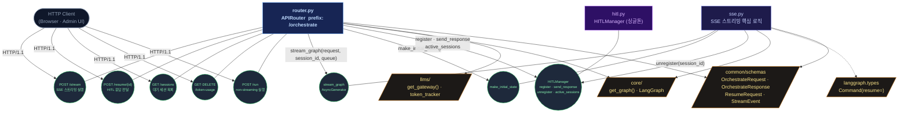

# AI Orchestrator — streaming/ 컴포넌트 다이어그램

```mermaid
flowchart TD

    CALLER(["HTTP Client\n(Browser · Admin UI)"])

    %% ── router.py ────────────────────────────────────────────
    ROUTER["router.py\nAPIRouter  prefix: /orchestrate"]
    IF_STREAM(("POST /stream\nSSE 스트리밍 실행"))
    IF_RESUME(("POST /resume/{id}\nHITL 응답 전달"))
    IF_SESSIONS(("GET /sessions\n대기 세션 목록"))
    IF_TOKEN(("GET·DELETE\n/token-usage"))
    IF_RUN(("POST /run\nnon-streaming 실행"))
    ROUTER --- IF_STREAM
    ROUTER --- IF_RESUME
    ROUTER --- IF_SESSIONS
    ROUTER --- IF_TOKEN
    ROUTER --- IF_RUN

    %% ── sse.py ───────────────────────────────────────────────
    SSE["sse.py\nSSE 스트리밍 핵심 로직"]
    IF_STREAM_GRAPH(("stream_graph\nAsyncGenerator"))
    IF_INIT_STATE(("make_initial_state"))
    SSE --- IF_STREAM_GRAPH
    SSE --- IF_INIT_STATE

    %% ── hitl.py ──────────────────────────────────────────────
    HITL["hitl.py\nHITLManager  (싱글톤)"]
    IF_HITL(("HITLManager\nregister · send_response\nunregister · active_sessions"))
    HITL --- IF_HITL

    %% ── 외부 의존성 ──────────────────────────────────────────
    CORE[/"core/\nget_graph() · LangGraph"/]
    LLM_GW[/"llms/\nget_gateway() · token_tracker"/]
    COMMON[/"common/schemas\nOrchestrateRequest · OrchestrateResponse\nResumeRequest · StreamEvent"/]
    LG_CMD[/"langgraph.types\nCommand(resume=)"/]

    %% ── Connectors ───────────────────────────────────────────
    CALLER -->|"HTTP/1.1"| IF_STREAM
    CALLER -->|"HTTP/1.1"| IF_RESUME
    CALLER -->|"HTTP/1.1"| IF_SESSIONS
    CALLER -->|"HTTP/1.1"| IF_TOKEN
    CALLER -->|"HTTP/1.1"| IF_RUN

    ROUTER -->|"stream_graph(request, session_id, queue)"| IF_STREAM_GRAPH
    ROUTER -->|"make_initial_state()"| IF_INIT_STATE
    ROUTER -->|"register · send_response\nactive_sessions"| IF_HITL

    SSE -->|"unregister(session_id)"| IF_HITL

    ROUTER --> CORE
    SSE    --> CORE
    ROUTER --> LLM_GW
    SSE    -.-> LG_CMD
    ROUTER --> COMMON
    SSE    --> COMMON

    %% ── 스타일 ───────────────────────────────────────────────
    classDef routerCls fill:#172554,stroke:#60a5fa,color:#bfdbfe,font-weight:bold
    classDef sseCls    fill:#1e1b4b,stroke:#818cf8,color:#c7d2fe
    classDef hitlCls   fill:#2e1065,stroke:#a855f7,color:#d8b4fe
    classDef ifaceCls  fill:#1e293b,stroke:#22c55e,color:#86efac,font-size:11px
    classDef extCls    fill:#1c1917,stroke:#d97706,color:#fde68a
    classDef callerCls fill:#0f172a,stroke:#94a3b8,color:#94a3b8

    class ROUTER routerCls
    class SSE sseCls
    class HITL hitlCls
    class IF_STREAM,IF_RESUME,IF_SESSIONS,IF_TOKEN,IF_RUN,IF_STREAM_GRAPH,IF_INIT_STATE,IF_HITL ifaceCls
    class CORE,LLM_GW,COMMON,LG_CMD extCls
    class CALLER callerCls
```
